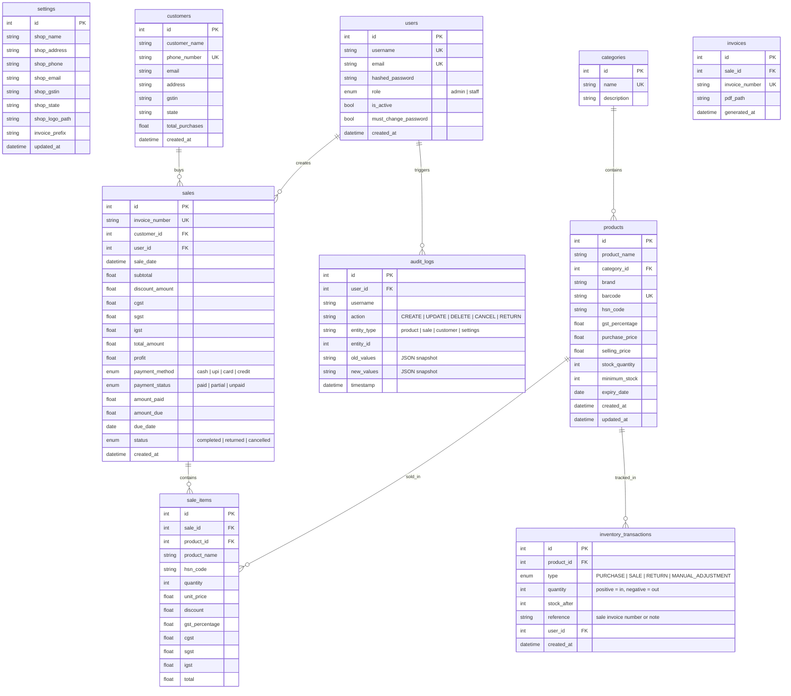

# RetailERP Lite – Implementation Plan (v2)

A production-ready retail management system with GST billing, inventory management, customer CRM, sales tracking, and PDF invoice generation — built MVP-first.

---

## Changes from v1 (User Feedback Applied)

| # | Change | Rationale |
|:--|:-------|:----------|
| 1 | ~~Loyalty points~~ → deferred to Phase 4 | Small shops don't use this |
| 2 | ~~Self-registration~~ → Default admin + admin creates staff | Real shops don't allow self-register |
| 3 | Audit logs moved to Phase 1 | Track who deleted/changed/cancelled what |
| 4 | Settings table (not env vars) for shop info | Owner edits from UI, not config files |
| 5 | **Stock ledger** (`inventory_transactions`) added | Every stock movement recorded — critical for debugging |
| 6 | **Payment tracking** added to sales | Cash/UPI/Card/Credit — essential for real shops |
| 7 | **Credit sales** support added | amount_paid, amount_due, due_date |
| 8 | **Phases restructured** to MVP-first | Auth + Products + Customers + Sales + GST + PDF = shippable MVP |

---

## Open Questions

1. **Default Admin Credentials**: I'll seed `admin / admin123` on first run with a forced password change prompt. Acceptable?
2. **Credit Due Date**: Should overdue credits show as red alerts on the dashboard, or just in the customer view?
3. **Invoice Number Format**: `INV-YYYYMMDD-XXXX` (e.g., `INV-20260609-0001`) — is this format fine?

---

## Phase Overview

| Phase | Scope | Deliverable |
|:------|:------|:------------|
| **Phase 1 (MVP)** | Auth, Products, Customers, Sales, GST Billing, PDF Invoice, Inventory Tracking, Audit Logs, Settings, Stock Ledger, Payment & Credit | **Fully usable billing system** |
| **Phase 2** | Suppliers, Purchases, Stock Ledger expansion, Reports (PDF/Excel) | Purchase management + reporting |
| **Phase 3** | Analytics Dashboard, Expenses, Backup/Restore, Global Search | Business intelligence layer |
| **Phase 4** | Barcode Scanner, QR Payments, Loyalty Points, Docker Deployment | Advanced features + deployment |

---

## Project Structure

```
Papa_project/
├── backend/
│   ├── app/
│   │   ├── main.py
│   │   ├── core/
│   │   │   ├── config.py              # Pydantic BaseSettings (DB URL, JWT secret only)
│   │   │   ├── database.py            # SQLAlchemy engine, session, Base
│   │   │   ├── security.py            # JWT + bcrypt
│   │   │   └── dependencies.py        # get_db, get_current_user, require_admin
│   │   ├── auth/
│   │   │   ├── models.py              # User
│   │   │   ├── schemas.py
│   │   │   ├── router.py
│   │   │   └── service.py
│   │   ├── settings/
│   │   │   ├── models.py              # Settings (shop info)
│   │   │   ├── schemas.py
│   │   │   ├── router.py
│   │   │   └── service.py
│   │   ├── products/
│   │   │   ├── models.py              # Product, Category
│   │   │   ├── schemas.py
│   │   │   ├── router.py
│   │   │   └── service.py
│   │   ├── customers/
│   │   │   ├── models.py
│   │   │   ├── schemas.py
│   │   │   ├── router.py
│   │   │   └── service.py
│   │   ├── inventory/
│   │   │   ├── models.py              # InventoryTransaction (stock ledger)
│   │   │   ├── schemas.py
│   │   │   ├── router.py
│   │   │   └── service.py
│   │   ├── sales/
│   │   │   ├── models.py              # Sale, SaleItem
│   │   │   ├── schemas.py
│   │   │   ├── router.py
│   │   │   └── service.py
│   │   ├── invoices/
│   │   │   ├── models.py
│   │   │   ├── schemas.py
│   │   │   ├── router.py
│   │   │   ├── service.py
│   │   │   └── pdf_generator.py       # ReportLab + QR code
│   │   └── audit/
│   │       ├── models.py              # AuditLog
│   │       ├── schemas.py
│   │       ├── router.py
│   │       └── service.py
│   ├── requirements.txt
│   └── seed.py                        # Seeds default admin account
├── frontend/
│   ├── src/
│   │   ├── main.jsx
│   │   ├── App.jsx
│   │   ├── index.css
│   │   ├── api/
│   │   │   └── axios.js
│   │   ├── context/
│   │   │   └── AuthContext.jsx
│   │   ├── components/
│   │   │   ├── Layout.jsx
│   │   │   ├── Sidebar.jsx
│   │   │   ├── Header.jsx
│   │   │   ├── DataTable.jsx
│   │   │   ├── Modal.jsx
│   │   │   ├── StatsCard.jsx
│   │   │   └── ProtectedRoute.jsx
│   │   ├── pages/
│   │   │   ├── Login.jsx
│   │   │   ├── Dashboard.jsx
│   │   │   ├── Products.jsx
│   │   │   ├── ProductForm.jsx
│   │   │   ├── Customers.jsx
│   │   │   ├── CustomerForm.jsx
│   │   │   ├── Sales.jsx
│   │   │   ├── NewSale.jsx            # POS-style billing
│   │   │   ├── Invoices.jsx
│   │   │   ├── InvoiceView.jsx
│   │   │   ├── AuditLogs.jsx
│   │   │   ├── Settings.jsx
│   │   │   ├── StaffManagement.jsx
│   │   │   └── NotFound.jsx
│   │   ├── hooks/
│   │   │   └── useAuth.js
│   │   └── utils/
│   │       ├── gstCalculator.js
│   │       └── formatters.js
│   ├── index.html
│   ├── vite.config.js
│   └── package.json
├── .env
├── .gitignore
└── README.md
```

---

## Database Schema



---

## Phase 1 — MVP (Detailed)

> This phase produces a **fully usable GST billing system** that a shop owner can start using on day one.

---

### 1.1 Backend Infrastructure

#### [NEW] `backend/requirements.txt`
```
fastapi==0.115.0
uvicorn[standard]==0.30.0
sqlalchemy==2.0.35
pydantic==2.9.0
pydantic-settings==2.5.0
python-jose[cryptography]==3.3.0
passlib[bcrypt]==1.7.4
python-multipart==0.0.12
reportlab==4.2.0
qrcode[pil]==7.4.2
openpyxl==3.1.5
aiofiles==24.1.0
```

#### [NEW] `backend/app/core/config.py`
- `Settings(BaseSettings)` — only infrastructure config:
  - `DATABASE_URL` (default: `sqlite:///./retailerp.db`)
  - `SECRET_KEY` (default: generated)
  - `ACCESS_TOKEN_EXPIRE_MINUTES` (default: 480 = 8 hours)
- Shop-level settings live in the `settings` DB table, not here

#### [NEW] `backend/app/core/database.py`
- SQLAlchemy sync engine (SQLite)
- `SessionLocal` with `autocommit=False, autoflush=False`
- `Base` with naming conventions for constraints

#### [NEW] `backend/app/core/security.py`
- `hash_password(plain)` → bcrypt hash
- `verify_password(plain, hashed)` → bool
- `create_access_token(user_id, role)` → JWT string (HS256)
- `decode_access_token(token)` → payload dict

#### [NEW] `backend/app/core/dependencies.py`
- `get_db()` → yields session, closes on exit
- `get_current_user(token, db)` → User object or 401
- `require_admin(current_user)` → User or 403

#### [NEW] `backend/app/main.py`
- FastAPI app with metadata (title, version, description)
- CORS middleware (allow `http://localhost:5173`)
- Include all Phase 1 routers under `/api`
- Startup event: create tables + seed default admin if no users exist
- `GET /api/health` → `{"status": "ok"}`

#### [NEW] `backend/seed.py`
- Check if any user exists
- If not, create: `username=admin, password=admin123, role=admin, must_change_password=True`

---

### 1.2 Auth Module (No Self-Registration)

#### [NEW] `backend/app/auth/models.py`
```python
class User:
    id, username, email, hashed_password, role, is_active, must_change_password, created_at
```

#### [NEW] `backend/app/auth/schemas.py`
- `LoginRequest(username, password)`
- `UserResponse(id, username, email, role, is_active, created_at)`
- `Token(access_token, token_type, user)`
- `CreateStaffRequest(username, email, password, role)` — admin only
- `ChangePasswordRequest(old_password, new_password)`

#### [NEW] `backend/app/auth/router.py`
| Method | Endpoint | Access | Purpose |
|:-------|:---------|:-------|:--------|
| POST | `/api/auth/login` | Public | Login → JWT |
| GET | `/api/auth/me` | Auth | Current user info |
| POST | `/api/auth/change-password` | Auth | Change own password |
| POST | `/api/auth/staff` | Admin | Create staff account |
| GET | `/api/auth/users` | Admin | List all users |
| PUT | `/api/auth/users/{id}/toggle` | Admin | Activate/deactivate user |

#### [NEW] `backend/app/auth/service.py`
- `authenticate(username, password)` → token or 401
- `create_staff(admin_id, data)` → new user
- `change_password(user, old, new)` → updated
- No `register()` — no self-registration

---

### 1.3 Settings Module

#### [NEW] `backend/app/settings/models.py`
```python
class Settings:
    id, shop_name, shop_address, shop_phone, shop_email,
    shop_gstin, shop_state, shop_logo_path, invoice_prefix, updated_at
```
- Singleton pattern — only 1 row, seeded on startup with defaults

#### [NEW] `backend/app/settings/router.py`
| Method | Endpoint | Access | Purpose |
|:-------|:---------|:-------|:--------|
| GET | `/api/settings` | Auth | Get shop settings |
| PUT | `/api/settings` | Admin | Update shop settings |

---

### 1.4 Audit Log Module

#### [NEW] `backend/app/audit/models.py`
```python
class AuditLog:
    id, user_id, username, action, entity_type, entity_id,
    old_values (JSON), new_values (JSON), timestamp
```

#### [NEW] `backend/app/audit/service.py`
- `log_action(db, user, action, entity_type, entity_id, old_values=None, new_values=None)`
- Called from every CREATE, UPDATE, DELETE, CANCEL, RETURN operation
- Stores JSON snapshots of old and new values for traceability

#### [NEW] `backend/app/audit/router.py`
| Method | Endpoint | Access | Purpose |
|:-------|:---------|:-------|:--------|
| GET | `/api/audit-logs` | Admin | List logs (paginated, filterable by entity/action/date) |

---

### 1.5 Products Module

#### [NEW] `backend/app/products/models.py`
- `Category`: id, name, description
- `Product`: all fields from spec (no supplier_id in Phase 1 — suppliers come in Phase 2)

#### [NEW] `backend/app/products/router.py`
| Method | Endpoint | Access | Purpose |
|:-------|:---------|:-------|:--------|
| GET | `/api/products` | Auth | List (search, filter, paginate) |
| POST | `/api/products` | Admin | Create product |
| GET | `/api/products/{id}` | Auth | Get product detail |
| PUT | `/api/products/{id}` | Admin | Update product |
| DELETE | `/api/products/{id}` | Admin | Delete product |
| GET | `/api/products/low-stock` | Auth | Products below minimum_stock |
| GET | `/api/categories` | Auth | List categories |
| POST | `/api/categories` | Admin | Create category |

#### [NEW] `backend/app/products/service.py`
- Full CRUD with search (name, barcode, category)
- Pagination: `skip`, `limit`, `search`, `category_id`, `stock_status`
- All mutations log to audit trail
- `get_low_stock()` — products where `stock_quantity <= minimum_stock`

---

### 1.6 Customers Module

#### [NEW] `backend/app/customers/models.py`
- All fields from spec **minus** `loyalty_points` (deferred)
- `state` field added (for CGST/SGST vs IGST determination)

#### [NEW] `backend/app/customers/router.py`
| Method | Endpoint | Access | Purpose |
|:-------|:---------|:-------|:--------|
| GET | `/api/customers` | Auth | List (search, paginate) |
| POST | `/api/customers` | Auth | Create |
| GET | `/api/customers/{id}` | Auth | Detail + purchase summary |
| PUT | `/api/customers/{id}` | Auth | Update |
| DELETE | `/api/customers/{id}` | Admin | Delete |
| GET | `/api/customers/{id}/sales` | Auth | Customer's sale history |
| GET | `/api/customers/credit-due` | Auth | Customers with outstanding credit |

---

### 1.7 Inventory / Stock Ledger Module

#### [NEW] `backend/app/inventory/models.py`
```python
class InventoryTransaction:
    id, product_id, type (PURCHASE|SALE|RETURN|MANUAL_ADJUSTMENT),
    quantity (+/-), stock_after, reference, user_id, created_at
```

#### [NEW] `backend/app/inventory/service.py`
- `record_movement(db, product_id, type, quantity, reference, user_id)`
  - Updates `product.stock_quantity`
  - Records `stock_after` snapshot
  - Returns the transaction
- Called by: sale creation (SALE, negative), sale return (RETURN, positive), manual adjustment
- `get_product_ledger(product_id)` — full history for a product

#### [NEW] `backend/app/inventory/router.py`
| Method | Endpoint | Access | Purpose |
|:-------|:---------|:-------|:--------|
| GET | `/api/inventory/{product_id}/ledger` | Auth | Stock movement history |
| POST | `/api/inventory/adjust` | Admin | Manual stock adjustment |

---

### 1.8 Sales & GST Billing Module

#### [NEW] `backend/app/sales/models.py`
```python
class Sale:
    id, invoice_number, customer_id, user_id, sale_date,
    subtotal, discount_amount, cgst, sgst, igst, total_amount, profit,
    payment_method (cash|upi|card|credit),
    payment_status (paid|partial|unpaid),
    amount_paid, amount_due, due_date,
    status (completed|returned|cancelled), created_at

class SaleItem:
    id, sale_id, product_id, product_name, hsn_code,
    quantity, unit_price, discount, gst_percentage,
    cgst, sgst, igst, total
```

#### [NEW] `backend/app/sales/service.py`
- **GST Engine**:
  - Load shop state from `settings` table
  - Compare with customer state
  - Same state → split GST into CGST + SGST (50/50)
  - Different state → apply full as IGST
  - Walk-in customer (no GSTIN) → default to intra-state (CGST+SGST)
- **Invoice number generation**: `{prefix}-YYYYMMDD-{sequential}` from settings
- **Create sale**:
  1. Validate stock availability for all items
  2. Calculate GST per item
  3. Calculate profit per item (`selling_price - purchase_price`)
  4. Deduct stock via inventory service (records ledger entry)
  5. Update customer `total_purchases`
  6. Log audit trail
  7. Return sale with all details
- **Credit sale handling**:
  - If `payment_method = credit`: set `payment_status`, `amount_paid`, `amount_due`, `due_date`
  - Endpoint to record additional payments against credit sales
- **Return sale**: reverse stock via inventory service, log audit
- **Cancel sale**: mark cancelled, reverse stock, log audit

#### [NEW] `backend/app/sales/router.py`
| Method | Endpoint | Access | Purpose |
|:-------|:---------|:-------|:--------|
| POST | `/api/sales` | Auth | Create sale |
| GET | `/api/sales` | Auth | List (date range, customer, status filter) |
| GET | `/api/sales/{id}` | Auth | Sale detail with items |
| POST | `/api/sales/{id}/return` | Admin | Return sale |
| POST | `/api/sales/{id}/cancel` | Admin | Cancel sale |
| POST | `/api/sales/{id}/payment` | Auth | Record payment against credit sale |
| GET | `/api/sales/credit-pending` | Auth | All unpaid/partial sales |

---

### 1.9 Invoice & PDF Generation

#### [NEW] `backend/app/invoices/pdf_generator.py`
ReportLab-based A4 PDF with:
- **Header**: Shop name, address, GSTIN, phone (from settings table)
- **Invoice meta**: Invoice number, date, customer details
- **Product table**: Item | HSN | Qty | Rate | Disc | CGST | SGST/IGST | Total
- **Tax summary**: Grouped by GST slab (5%, 12%, 18%, 28%)
- **Totals**: Subtotal, Discount, Tax, **Grand Total** (also in words)
- **Payment info**: Method, paid amount, due amount
- **QR code**: Encodes invoice number + total + shop GSTIN
- **Footer**: Signature section, "Thank you for your business"

#### [NEW] `backend/app/invoices/router.py`
| Method | Endpoint | Access | Purpose |
|:-------|:---------|:-------|:--------|
| GET | `/api/invoices` | Auth | List invoices |
| GET | `/api/invoices/{sale_id}/pdf` | Auth | Download PDF |

---

### 1.10 Frontend — Shared Components

#### [NEW] `frontend/src/components/Layout.jsx`
- Dark-themed responsive shell
- Collapsible sidebar (hamburger on mobile)
- Header with user dropdown
- Content area with padding

#### [NEW] `frontend/src/components/Sidebar.jsx`
- Nav items with lucide-react icons
- Active state with indigo highlight
- Role-based filtering (staff can't see admin-only items)
- Sections: Dashboard, Products, Customers, Sales, Invoices, Audit Logs (admin), Settings (admin)
- Smooth collapse/expand animation

#### [NEW] `frontend/src/components/Header.jsx`
- Page title
- User avatar + dropdown (profile, change password, logout)
- Notification badge (low stock count)

#### [NEW] `frontend/src/components/DataTable.jsx`
- Props: columns, data, loading, onEdit, onDelete, onRowClick
- Built-in: search input, column sorting, pagination controls
- Loading skeleton state
- Empty state with illustration
- Responsive (horizontal scroll on mobile)

#### [NEW] `frontend/src/components/Modal.jsx`
- Animated slide-in with backdrop blur
- Close on Escape / backdrop click
- Configurable: title, size (sm/md/lg/xl), footer actions

#### [NEW] `frontend/src/components/StatsCard.jsx`
- Glassmorphism card with icon, value, label
- Optional trend indicator (↑ +12% in green, ↓ -5% in red)
- Count-up animation on mount

#### [NEW] `frontend/src/components/ProtectedRoute.jsx`
- Checks auth context
- Redirects to `/login` if not authenticated
- Optional `requiredRole` prop → 403 page if role mismatch

---

### 1.11 Frontend — Pages

#### [NEW] `frontend/src/pages/Login.jsx`
- Full-screen dark gradient background
- Centered login card with glassmorphism
- Username + password fields
- "Change Password" modal if `must_change_password` flag is set
- Error handling with toast

#### [NEW] `frontend/src/pages/Dashboard.jsx`
- **Stats row**: Today's Sales, Total Revenue, Total Products, Low Stock Count
- **Quick actions**: New Sale, Add Product, Add Customer
- **Recent Sales**: Last 10 sales in mini table
- **Low Stock Alerts**: Products below threshold with stock count
- **Credit Due**: Customers with outstanding balances

#### [NEW] `frontend/src/pages/Products.jsx`
- DataTable with columns: Name, Category, Brand, Stock, Price, GST%
- Stock badges: green (normal), amber (low), red (out of stock)
- Filter bar: category dropdown, stock status toggle
- Add/Edit via ProductForm modal
- Delete with confirmation dialog
- Click row → product detail with stock ledger

#### [NEW] `frontend/src/pages/ProductForm.jsx`
- Modal form for add/edit
- Fields: name, category (dropdown + "add new"), brand, barcode, HSN, GST% (dropdown: 0/5/12/18/28), purchase price, selling price, stock qty, minimum stock, expiry date
- Validation: required fields, price > 0, stock >= 0
- On edit: pre-fills all fields

#### [NEW] `frontend/src/pages/Customers.jsx`
- DataTable: Name, Phone, Email, State, Total Purchases, Credit Due
- Search by name or phone
- Add/Edit via CustomerForm modal
- Click row → customer detail with sale history
- "Credit Due" tab/filter for customers with unpaid balances

#### [NEW] `frontend/src/pages/NewSale.jsx` (POS-Style Billing)
- **Left panel**: Product search (type to search by name/barcode), click to add to cart
- **Right panel**: Cart with line items
  - Each item: name, qty (+/- buttons), price, discount input, GST breakdown, line total
  - Remove item button
- **Customer section**: Search existing / create new / walk-in toggle
- **Payment section**:
  - Method selector: Cash | UPI | Card | Credit
  - If credit: amount_paid input, due_date picker
- **GST summary**: Subtotal, CGST total, SGST total (or IGST total), Discount, **Grand Total**
- **"Complete Sale"** button → creates sale + auto-downloads PDF invoice
- Keyboard shortcuts: F2 (new sale), F5 (complete), Esc (clear)

#### [NEW] `frontend/src/pages/Sales.jsx`
- DataTable: Invoice#, Date, Customer, Items, Total, Payment, Status
- Status badges: green (completed), amber (partial payment), red (cancelled/returned)
- Filters: date range, status, payment method
- Row actions: View, Download PDF, Return (admin), Cancel (admin)
- Record Payment button for credit sales

#### [NEW] `frontend/src/pages/InvoiceView.jsx`
- Full invoice preview styled to match PDF layout
- Download PDF button
- Print button (browser print)

#### [NEW] `frontend/src/pages/AuditLogs.jsx` (Admin Only)
- DataTable: Timestamp, User, Action, Entity, Details
- Filters: entity type, action type, date range, user
- Expandable row to show old_values vs new_values diff

#### [NEW] `frontend/src/pages/Settings.jsx` (Admin Only)
- Shop info form: name, address, phone, email, GSTIN, state, invoice prefix
- Save button with success toast
- Staff management section (link to StaffManagement page)

#### [NEW] `frontend/src/pages/StaffManagement.jsx` (Admin Only)
- List of users with role, status, created date
- "Add Staff" button → modal form (username, email, password, role)
- Toggle active/inactive for existing staff

---

### 1.12 Frontend — Utilities

#### [NEW] `frontend/src/utils/gstCalculator.js`
```javascript
calculateGST(price, gstRate, isInterState) → { cgst, sgst, igst, total }
// isInterState: true → igst = full rate, cgst = sgst = 0
// isInterState: false → cgst = sgst = rate/2, igst = 0
```

#### [NEW] `frontend/src/utils/formatters.js`
- `formatCurrency(amount)` → `₹1,234.56`
- `formatDate(date)` → `09 Jun 2026`
- `numberToWords(num)` → `"One Thousand Two Hundred Thirty-Four Rupees and Fifty-Six Paise Only"`

---

## Design System

| Token | Value |
|:------|:------|
| **Primary** | Indigo-600 `#4F46E5` |
| **Primary Hover** | Indigo-500 `#6366F1` |
| **Background** | Slate-950 `#020617` |
| **Surface** | Slate-900 `#0F172A` |
| **Surface Elevated** | Slate-800 `#1E293B` |
| **Text Primary** | Slate-50 `#F8FAFC` |
| **Text Secondary** | Slate-400 `#94A3B8` |
| **Border** | Slate-700 `#334155` |
| **Success** | Emerald-500 `#10B981` |
| **Warning** | Amber-500 `#F59E0B` |
| **Danger** | Rose-500 `#F43F5E` |
| **Font** | Inter (Google Fonts) |
| **Radius Cards** | 12px |
| **Radius Buttons** | 8px |

UI features:
- Dark mode default with glassmorphism cards (`backdrop-blur, bg-white/5, border-white/10`)
- Gradient accents on primary buttons and active sidebar items
- Micro-animations: count-up on stats, fade-in on table rows, slide-in on modals
- Responsive: sidebar collapses on mobile, tables scroll horizontally

---

## Phase 2 — Suppliers, Purchases, Reports (Future)

- Supplier CRUD module
- Purchase management (create purchase → auto-increase stock via ledger)
- Add `supplier_id` FK to products
- Reports: Sales, Inventory, GST, Customer, P&L
- PDF & Excel export for all reports

## Phase 3 — Analytics, Expenses, Backup, Search (Future)

- Analytics dashboard with Recharts (revenue trends, top products, top customers)
- Expense tracking module (rent, salary, utilities)
- Net profit calculation (revenue - COGS - expenses)
- Backup/restore (CSV, JSON, Excel export)
- Global search (Ctrl+K command palette)

## Phase 4 — Advanced Features (Future)

- Barcode scanner (camera-based via pyzbar + OpenCV)
- QR code payments
- Loyalty points system
- Docker deployment (backend + frontend + nginx)
- Multi-store support

---

## Verification Plan

### Automated
```bash
# Backend starts without errors
cd backend && uvicorn app.main:app --reload

# Frontend builds without errors
cd frontend && npm run build
```

### Manual Testing (Phase 1 MVP)
1. **Auth**: Default admin login → forced password change → create staff → staff login → verify restricted access
2. **Products**: Add product with GST% → edit → verify stock → delete → check audit log
3. **Customers**: Add customer with state → edit → delete → verify audit log
4. **Sale (Cash)**: Create sale → verify stock deduction → verify stock ledger entry → verify GST calculation → download PDF
5. **Sale (Credit)**: Create credit sale → verify amount_due → record partial payment → verify updated balance
6. **Sale (Return)**: Return sale → verify stock restored → verify ledger entry → check audit log
7. **Invoice PDF**: Verify shop header, customer info, product table, GST breakdown, QR code, totals in words
8. **Dashboard**: Verify stats match actual data, low stock alerts show correctly
9. **Settings**: Update shop info → verify invoice PDF reflects new info
10. **Audit Trail**: Verify all mutations (create/update/delete/cancel/return) appear with correct old/new values
